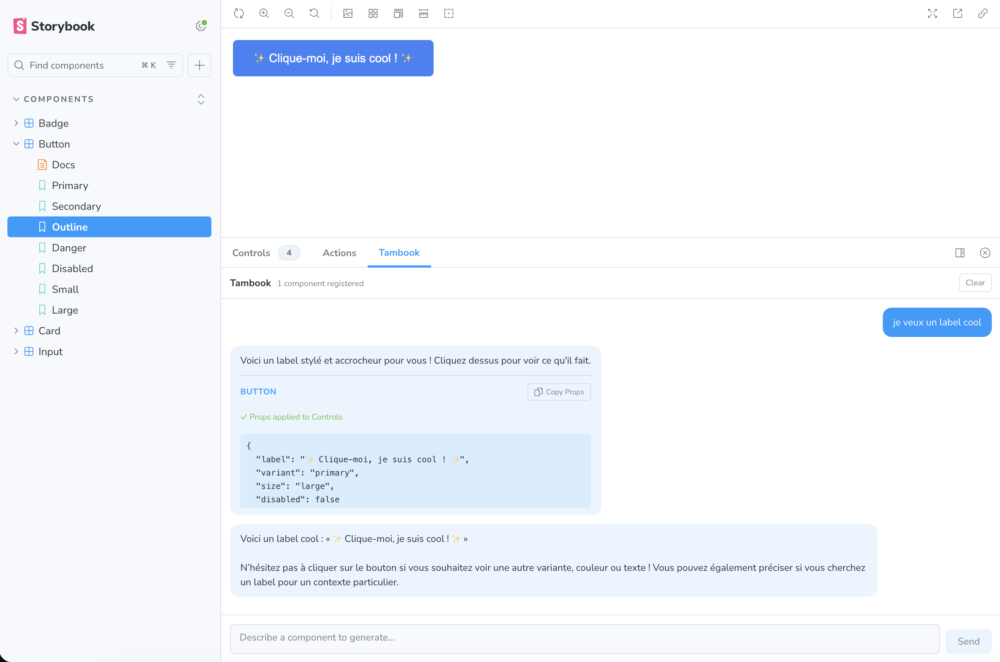
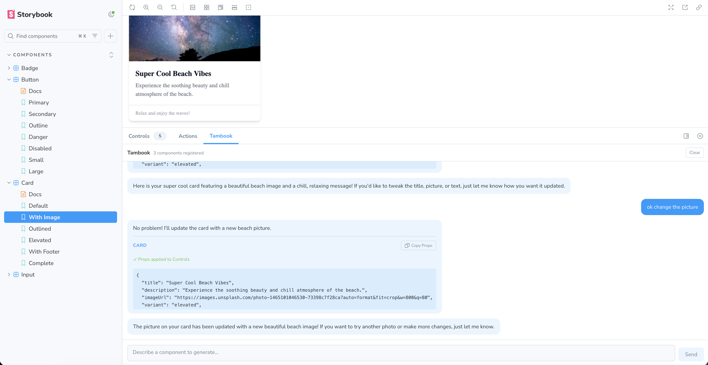
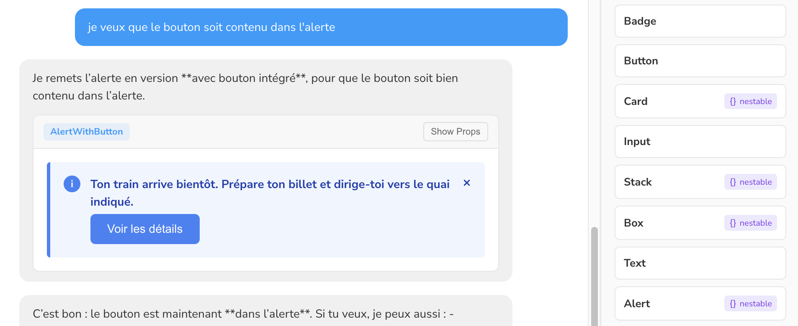

# tambook

Talk to your design system.

A Storybook addon powered by [Tambo](https://tambo.co). Describe what you want in natural language and see your components come to life.

<table>
  <tr>
    <td></td>
    <td></td>
  </tr>
  <tr>
    <td colspan="2"></td>
  </tr>
</table>

## Try It

```bash
git clone https://github.com/your-username/tambook.git
cd tambook
npm install
npm run example:install
```

Add your API key (get one free at [tambo.co](https://tambo.co)):

```bash
echo "STORYBOOK_TAMBO_API_KEY=your-api-key" > examples/storybook-demo/.env
```

Run Storybook:

```bash
npm run example:storybook
```

Open http://localhost:6006 and find the **Tambook** panel.

## Example Prompts

- "Build a pricing card for a Pro plan at $29/month with 5 features"
- "Create a user profile card for a software engineer from San Francisco"
- "Make a contact form with name, email, and message fields"
- "Design an error alert for when a payment fails"

## License

MIT
